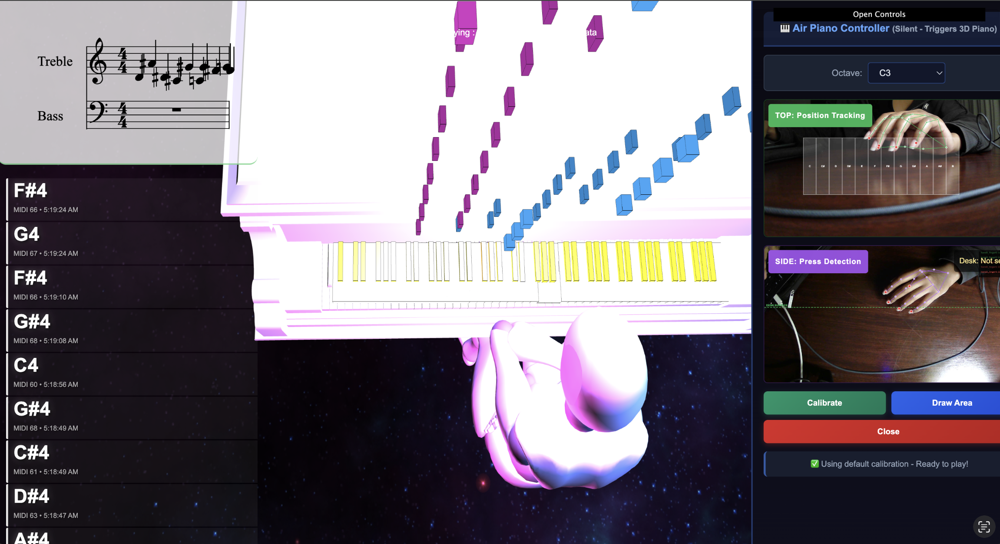

# 🎹 AiRPiano - Interactive 3D Piano Learning Platform

> **"Learn piano anywhere, no instrument required"**


<p align="center">
    
p>


AiRPiano is an innovative web-based platform that makes music education accessible to everyone by transforming any space into a virtual piano studio. Using computer vision and 3D graphics, students can learn and practice piano without owning an instrument, just a webcam and a browser.

Built for **HackPrinceton** : Making learning and entertainment more interactive, accessible, and personalized.



---

## 🌟 Project Vision

**The Problem**: Traditional piano education requires expensive instruments, private lessons, and dedicated practice spaces, creating significant barriers to entry for many aspiring musicians worldwide.

**Our Solution**: Air Piano democratizes music education by combining computer vision with immersive 3D visualization, allowing anyone to learn piano through hand tracking and real-time feedback and thus not needing a physical instrument.

### How We Support Interactive & Accessible Learning

✨ **Interactive**: Real-time hand tracking translates your movements into music, with visual feedback through an animated 3D pianist  
♿ **Accessible**: No piano required, works with any webcam, making music education available to underserved communities  
🎯 **Personalized**: Teacher Mode provides instant feedback on note accuracy, and can be adapted to your learning pace  
🎮 **Engaging**: Gamified learning with visual note falls, recording/playback, and interactive sheet music  

---

## 🚀 Key Features

### 🎥 **Dual Camera Hand Tracking**
- Real-time bilateral hand pose estimation using MediaPipe
- Calibration system for personalized key mapping
- AiR piano mode play by moving your hands in 3D space
- Adjustable sensitivity and lift height for different playing styles

### 👨‍🏫 **Teacher Mode**
- Learn scales with guided exercises (C-Major scale included)
- Real-time note validation with immediate feedback
- Visual feedback banners (correct/incorrect indicators)
- Progress tracking through musical exercises
- Auto validates played notes against expected sequences

### 🎼 **Sheet Music & Notation**
- Live grand staff display (treble & bass clef)
- Real-time note transcription as you play
- OpenSheetMusicDisplay integration for professional notation
- MusicXML rendering for sheet music visualization
- Note history tracking with visual highlights

### 🎹 **MIDI Integration**
- Drag and drop MIDI file support
- Visual falling notes synchronized with 3D piano
- Learn any song by following visual cues
- MIDI playback with adjustable volume
- Track separation for left/right hand parts

### 🎨 **Immersive 3D Visualization**
- Photorealistic 3D grand piano model
- Animated pianist with anatomically accurate hand movements
- Dynamic lighting and camera controls
- Real-time key press animations
- Color-coded notes for visual learning

### 🎙️ **Recording & Playback**
- Record your practice sessions
- Play back recordings with visual feedback
- Compare your performance against original pieces
- Export capabilities for progress tracking

---

## 🛠️ Technologies Used

### **Languages**
- JavaScript (ES6+)
- HTML5
- CSS3
- MusicXML

### **Core Libraries & Frameworks**

**3D Graphics & Visualization**
- [Three.js](https://threejs.org/) - WebGL-based 3D rendering engine
- Blender - 3D model creation and animation

**Computer Vision & AI**
- [TensorFlow.js](https://www.tensorflow.org/js) - Machine learning in the browser
- [MediaPipe](https://mediapipe.dev/) - Hand tracking and pose estimation

**Music & Audio**
- [MIDI.js](https://github.com/mudcube/MIDI.js) - MIDI file parsing and playback
- [OpenSheetMusicDisplay](https://opensheetmusicdisplay.org/) - Sheet music rendering
- [VexFlow](https://www.vexflow.com/) - Music notation engraving
- Web Audio API - Real-time audio synthesis
- Web MIDI API - MIDI device integration

**UI & Controls**
- [dat.GUI](https://github.com/dataarts/dat.gui) - Real-time parameter control
- Custom CSS animations for feedback systems

### **Web APIs**
- WebGL - Hardware-accelerated 3D graphics
- MediaStream API - Webcam access
- Canvas API - 2D rendering contexts
- RequestAnimationFrame - Smooth 60fps animations

---

## 📦 Installation & Setup

### Prerequisites
- Modern web browser with WebGL support (Chrome, Firefox, Edge recommended)
- Webcam (for hand tracking features)
- Node.js (for dependency management)

### Quick Start

1. **Clone the repository**
```bash
git clone https://github.com/LindaMukundwa/Hack-Princeton.git
cd Hack-Princeton
```

2. **Install dependencies**
```bash
npm install
```

3. **Start a local server**
```bash
# Option 1: Using Python
python -m http.server 8000

# Option 2: Using Node.js http-server
npx http-server -p 8000
```

4. **Open in browser**
```
http://localhost:8000/MIDIPlayer3D.html
```

5. **Grant camera permissions** when prompted (required for hand tracking)

---

## 🎮 How to Use

### Basic Piano Playing
1. Enable **"Dual Cameras"** from the control panel
2. Position your hands in front of the webcam
3. Click **"Calibrate Dual Cameras"** and follow on-screen instructions
4. Start playing! Your hand movements will trigger piano notes

### Learning with Teacher Mode
1. Enable **"Teacher Mode"** from the control panel
2. The C-Major scale will display on the sheet music
3. Play the notes in sequence and green banner = correct, red banner = wrong
4. Use **"Reset Exercise"** to start over
5. Track your progress through the exercise

### Playing MIDI Files
1. Click **"Open Midi File"** or drag & drop a `.mid` file
2. Watch the falling notes visualization
3. Follow along with the animated pianist
4. Pause/play with the spacebar

### Recording Your Practice
1. Click **"Start Recording"** before you play
2. Play your piece
3. Click **"Stop Recording"**
4. Click **"Play Recording"** to hear yourself
5. Use **"Clear Recording"** to start fresh

---

## 🎯 Use Cases

- **Self-Taught Musicians**: Learn piano fundamentals without purchasing an instrument
- **Music Educators**: Demonstrate techniques with visual feedback in remote lessons
- **Rehabilitation**: Fine motor skill development through gamified piano practice
- **Music Therapy**: Accessible instrument for therapeutic applications
- **Budget-Conscious Learners**: Try piano before investing in a physical instrument
- **Space-Constrained Living**: Practice without a full-sized keyboard

---

## 🏗️ Project Architecture

```
Hack-Princeton/
├── js/
│   ├── main.js              # Core application logic & initialization
│   ├── teacherView.js       # Teacher mode & exercise validation
│   ├── dualCameraView.js    # Hand tracking & air piano
│   ├── midi/                # MIDI playback & audio synthesis
│   └── three/               # 3D rendering & loaders
├── css/
│   ├── MIDIPlayer.css       # Main styling
│   └── gui-hover.css        # UI component styles
├── model/                   # 3D models (piano, pianist)
├── soundfont/              # Instrument sound samples
├── inc/
│   ├── jasmid/             # MIDI file parsing
│   └── shim/               # WebAudio/WebMIDI polyfills
└── MIDIPlayer3D.html       # Application entry point
```

---

## Credits & Acknowledgments

### Original Three.js Project File
This project is built upon the foundation of [MidiPlayerJS3D](https://github.com/thibaultmanuel/MIDIPlayer3D) by **Thibault Manuel**.

**Original contributions by Thibault Manuel:**
- Three.js-based 3D piano visualization
- Animated pianist model with realistic hand movements
- MIDI file playback with synchronized note visualization
- Original project configuration and architecture

### HackPrinceton Team
- **Linda Mukundwa**
- **Colin Boykin** 

### Enhancements for HackPrinceton
- Dual camera hand tracking system with MediaPipe
- Teacher Mode with real-time feedback and exercise validation
- Air piano functionality with calibration
- Live sheet music transcription (grand staff)
- Recording and playback system
- Enhanced UI with draggable control panel
- Accessibility-focused features

---

## 🎓 Educational Impact

AiR Piano represents a **proof of concept** demonstrating how emerging technologies can break down barriers in music education. By blending computer vision, 3D graphics, and audio synthesis, we've created an MVP that shows the potential for:

- **Universal Access**: Bringing music education to communities without access to instruments
- **Inclusive Learning**: Supporting diverse learning styles through visual, auditory, and kinesthetic feedback
- **Scalable Education**: Enabling remote music instruction at scale
- **Innovation in EdTech**: Pioneering novel approaches to skill acquisition through technology

---

## 📝 License

This project builds upon MidiPlayerJS3D. Please refer to individual library licenses for their respective terms.

---

## 🔗 Links

- **Original Project**: [MidiPlayerJS3D by Thibault Manuel](https://github.com/thibaultmanuel/MIDIPlayer3D)
- **Live Demo**: [Original Demo](https://github.com/user-attachments/assets/63d03e50-1091-4b07-86a8-5e0a790a5910)
- **HackPrinceton**: [Event Website](https://www.hackprinceton.com/)

---

<div align="center">

**Built with ❤️ for HackPrinceton**

*Making music education accessible to all*

</div> 

